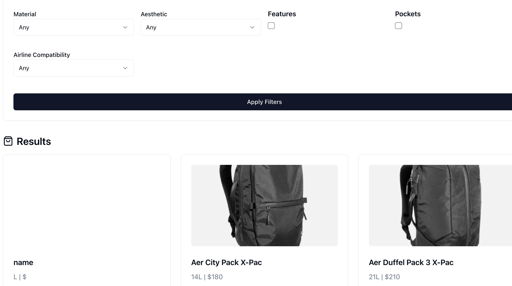

# OneBag Backpack Finder 🎒



## 📚 Table of Contents
- [About](#about)
- [Features](#features)
- [Tech Stack](#tech-stack)
- [Getting Started](#getting-started)
- [Usage](#usage)
- [Contributing](#contributing)
- [License](#license)

## 🌟 About

OneBag Backpack Finder is a comprehensive tool designed to help travelers find the perfect backpack for their one-bag travel adventures. With an extensive database of backpacks and their specifications, this application allows users to compare and filter backpacks based on various criteria, ensuring they find the ideal travel companion.

## 🚀 Features

- 🔍 Advanced search and filter options
- 📊 Detailed backpack specifications
- ✈️ Airline carry-on compatibility checker
- 📏 Size and weight comparisons
- 💼 Laptop compatibility information
- 🖼️ Visual backpack gallery
- 📱 Responsive design for mobile and desktop

## 🛠️ Tech Stack

- **Frontend**: Next.js, React, Tailwind CSS
- **Backend**: Next.js API Routes
- **Database**: PostgreSQL with Prisma ORM
- **Styling**: Shadcn UI components
- **Deployment**: Vercel

## 🏁 Getting Started

1. Clone the repository:
   ```
   git clone https://github.com/plotj/onebag.git
   ```

2. Install dependencies:
   ```
   cd onebag-backpack-finder
   npm install
   ```

3. Set up your environment variables:
   ```
   cp .env.example .env.local
   ```
   Then, edit `.env.local` with your database credentials.

4. Set up the database:
   ```
   npx prisma db push
   ```

5. Seed the database:
   ```
   npm run seed
   ```

6. Run the development server:
   ```
   npm run dev
   ```

7. Open [http://localhost:3000](http://localhost:3000) in your browser.

## 💻 Usage

1. Use the search bar to find backpacks by name or brand.
2. Apply filters to narrow down your search based on size, weight, features, etc.
3. Click on a backpack to view detailed specifications and compatibility information.
4. Compare multiple backpacks side-by-side.
5. Check airline compatibility for your chosen backpack.

## 📄 License

This project is licensed under the MIT License - see the [LICENSE](LICENSE) file for details.

